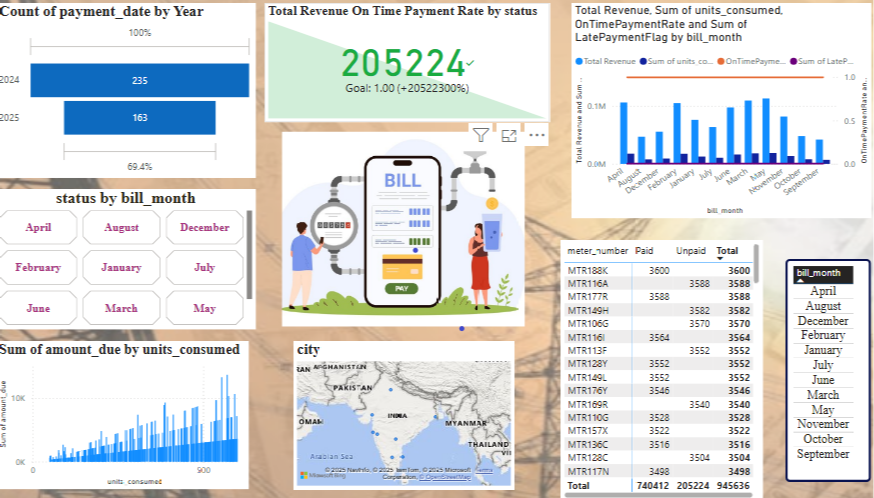

# ⚡ Power Bill Database System – Power BI Dashboard

A Power BI dashboard project designed to manage, analyze, and visualize electricity billing data. This project simulates a real-world utility billing system to extract key insights from payment and consumption patterns across different time periods and regions.

 🎯 Project Objective

To analyze electricity billing records and provide interactive, visual insights into customer payments, energy consumption, revenue patterns, and regional trends using Power BI.

 ✨ Features

- Interactive dashboard with dynamic filtering by billing month
- KPI card displaying total on-time revenue and goal tracking
- Visual comparison of payments by year
- Monthly trend analysis of revenue, units consumed, and payment behavior
- Consumption vs billing relationship graph
- City-wise geographical billing activity
- Meter-wise table of paid and unpaid amounts
-Used SQL queries to solve business problems

🛠 Tools Used

- Power BI – for building interactive visual dashboards  
- Excel/CSV – as the primary dataset format  
- SQL – for writing queries to analyze revenue, payment status, and usage

 📂 Dataset Summary

The dataset includes fields such as:

- `meter_number`: Unique customer meter IDs  
- `units_consumed`: Number of electricity units consumed  
- `amount_due`: Total amount billed  
- `payment_status`: Paid / Unpaid  
- `bill_month`: Month of billing  
- `payment_date`: Actual date of payment  
- `city`: Location of the customer  
- `on_time_payment_flag`: Indicates if payment was made on time  

 🖼️ Dashboard Preview

 🔍 Key Insights

- 💰 **205,224** revenue from on-time payments (goal exceeded)
- 🕒 Payments in 2024 were higher than 2025 (so far)
- 📈 Higher units consumed leads to a steeper rise in billed amount
- 🌍 Customers are spread across multiple cities in Asia
- 📆 On-time and late payments fluctuate month-to-month

 ▶️ How to Use

1. Clone or download this repository  
2. Open the `.pbix` file in **Power BI Desktop**  
3. If needed, reconnect the dataset to your local path  
4. Use the slicers (month, city, etc.) to explore the data  
5. Analyze trends, billing behavior, and revenue patterns

 🚀 Future Enhancements

- Add forecasting using Power BI's predictive analytics  
- Integrate SQL-based live database connection  
- Include customer feedback or satisfaction metrics  
- Drill-through to individual customer bill history  
- Automate data refresh with Power BI Service

 📬 Contact
 MANJULA SIVASAMY
📧 manjulasivasamy02@gmail.com  
💼 LinkedIn Profile:(www.linkedin.com/in/manjula-sivasamy-dataanalyst)  
🌐 GitHub:(https://github.com/ManjulaSivasamy-DataAnalyst)

